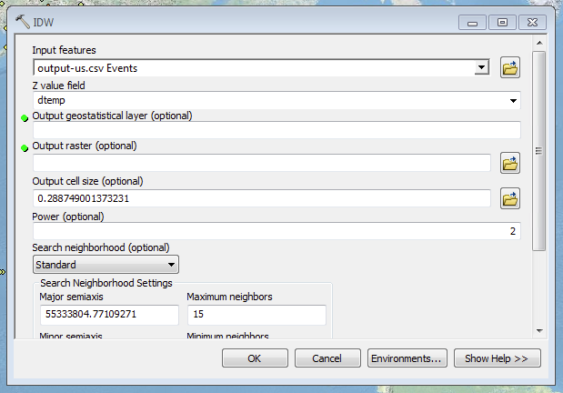
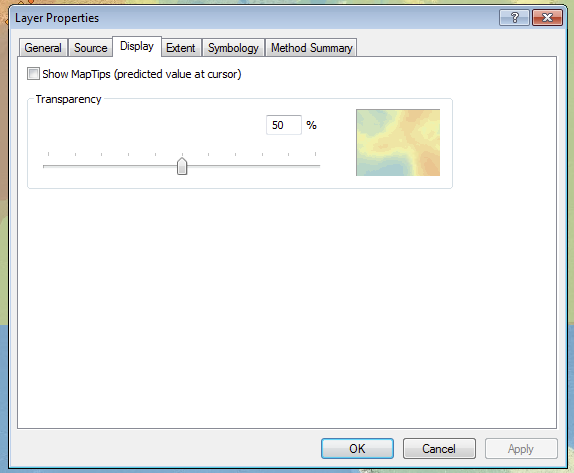
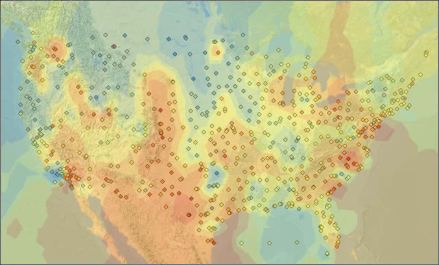

% Python and ArcGIS
% Eric Rochester
% 4 June 2013

## The Plan

1.  [Introductions](#/introductions)
2.  [What is Python?](#/python)
3.  [What Can I Do with It?](#/what-can-i-do-with-it)
4.  [A Problem](#/a-problem)
5.  [How to Solve It](/#how-to-solve-it)
6.  [Downloading Data](/#downloading-data)
7.  [Filtering and Fixing Data](/#filtering-and-fixing-data)
8.  [Getting Rolling Averages](/#getting-rolling-averages)
9.  [Charting Data](/#charting-data)
10. [Links and Resources](/#links-and-resources)

# Introductions

## Eric Rochester

[@erochest](https://twitter.com/erochest)<br>
[http://www.ericrochester.com/](http://www.ericrochester.com/)

## Scholars' Lab

[@scholarslab](https://twitter.com/scholarslab)<br>
[http://www.scholarslab.org/](http://www.scholarslab.org/)

## Who are you?

# Python

[http://python.org](http://python.org)

## A very high-level language

## Easy to write

Quirky (whitespace matters)

But clear

Not a lot of syntax to remember

## Easy to read

Not a lot of syntax to get in the way

Just verbose enough

## Easy to maintain 

## Let's See Some

``` {.python .fragment}
print 'hello, world!'
```

``` {.python .fragment}
def hello(name):
    print 'hello, ' + name
```

``` {.python .fragment}
for n in range(7):
    hello('number ' + str(n))
```

<div class='fragment'>
There's more, but we won't worry about that now.
</div>

# What Can I Do with It?

## Work with Files

```python
with open('some-file.txt', 'w') as f:
    f.write('hello, world!\n')
```

## Work with the Network

```python
import requests
r = requests.get('http://www.google.com')
print r.text[:20]
```

(Using the [requests](http://python-requests.org) library.)

## Create Websites

* [Django](https://www.djangoproject.com/)
* [Flask](http://flask.pocoo.org/)

```python
from flask import Flask
app = Flask(__name__)

@app.route("/")
def hello():
    return "Hello World!"

if __name__ == "__main__":
    app.run()
```

A very small Flask site.

## Scientific/Numerical Processing

* [numpy](http://www.numpy.org/)
* [pandas](http://pandas.pydata.org/)

```python
import numpy

signal = numpy.array([-2, 8, 6, 4, 1, 0, 3, 5], dtype=float)
fourier = numpy.fft.fft(signal)
n = signal.size
timestep = 0.1
freq = numpy.fft.fftfreq(n, d=timestep)
print freq
# [ 0.    1.25  2.5   3.75 -5.   -3.75 -2.5  -1.25]
```

## ArcGIS

<div class='fragment'>Schedule Jobs</div>

<div class='fragment'>Batch Processing</div>

<div class='fragment'>Automate Tasks and Tools</div>

<div class='fragment'>Loop through Records</div>

<div class='fragment'>Manipulate Maps, Layers, and Geometries</div>

<div class='fragment'>Use other Python Packages (<code>requests</code>,
<code>numpy</code>)</div>

# A Problem

## How to Solve It

<div class='fragment'>Download the Data</div>

<div class='fragment'>Filter the Data</div>

<div class='fragment'>Get Rolling Averages</div>

<div class='fragment'>Write It Out</div>

<div class='fragment'>Import It into ArcGIS</div>

<div class='fragment'>Generate the Map</div>

# Downloading Data

## Identify the Source

Global Summary of the Day (GSOD)

[ftp://ftp.ncdc.noaa.gov/pub/data/gsod/](ftp://ftp.ncdc.noaa.gov/pub/data/gsod/)

## Code Warning

## High-Level Plan

```python
HOST     = 'ftp.ncdc.noaa.gov'
PATH     = '/pub/data/gsod/'
YEAR     = re.compile(r'\d{4}')
DOWNLOAD = 'tars'
DATADIR  = 'data'

download(HOST, PATH, YEAR.match, DOWNLOAD)

for fn in glob.glob(os.path.join(DOWNLOAD, '*.tar')):
    untar(fn, DATADIR)

for fn in glob.glob(os.path.join(DATADIR, '*.gz')):
    ungzip(fn)

print('done.')
```

## Download

```python
def download(host, path, year_filter, target):
    """This downloads the files into the target directory. """
    if not os.path.exists(target):
        os.makedirs(target)

    with closing(ftplib.FTP(host)) as ftp:
        ftp.login()
        ftp.cwd(path)

        for dirname in ftp.nlst():
            if year_filter(dirname):
                src  = '%s/gsod_%s.tar' % (dirname, dirname)
                dest = os.path.join(target, 'gsod_%s.tar' % (dirname,))
                print('%s => %s' % (src, dest))

                with open(dest, 'wb') as f:
                    ftp.retrbinary('RETR ' + src, f.write)
```

## Un-tar

```python
def untar(input_file, dest):
    """This untars the file into the directory given."""
    with closing(tarfile.open(input_file, 'r')) as tf:
        tf.extractall(dest)
```

## Unzip

```python
def ungzip(input_file):
    """This un-gzips the input file and deletes the original."""
    dest = os.path.splitext(input_file)[0]
    print('%s => %s' % (input_file, dest))

    with closing(gzip.open(input_file, 'rb')) as zf:
        with closing(open(dest, 'wb')) as fout:
            fout.write(zf.read())

    os.remove(input_file)
```

## Now What?

What have we just accomplished?

Questions?

# Filtering and Fixing Data

## Make a Plan

## High-Level

```python
DATADIR = 'data'
HISTORY = 'ish-history.csv'
# This is from ftp://ftp.ncdc.noaa.gov/pub/data/gsod/country-list.txt
COUNTRY = 'US'

history  = read_history(HISTORY)
stations = get_stations(history, COUNTRY)

if not os.path.exists(COUNTRY):
    os.makedirs(COUNTRY)

for fn in glob.glob(os.path.join(DATADIR, '*.op')):
    basename = os.path.basename(fn)
    station  = tuple(basename.split('-')[:2])
    if station in stations:
        shutil.copyfile(fn, os.path.join(COUNTRY, basename))
```

## Read all Stations

```python
def read_history(fn):
    """This reads the ish-history.csv file into a sequence of named tuples. """
    with open(fn, 'rb') as f:
        for row in itertools.islice(csv.reader(f), 1, None):
            yield IshHistory._make(row)
```

## Filter for Stations in a Country

```python
def get_stations(history, country):
    """\
    This takes a seq of IshHistory objects and returns a set of stations
    for the country and state.

    """

    stations = set()
    for h in history:
        if h.country == country:
            stations.add((h.usaf, h.wban))
    return stations
```

## Filter the Data Files

You've already seen this.

```python
for fn in glob.glob(os.path.join(DATADIR, '*.op')):
    basename = os.path.basename(fn)
    station  = tuple(basename.split('-')[:2])
    if station in stations:
        shutil.copyfile(fn, os.path.join(COUNTRY, basename))
```

# Rolling Averages

## High Level

```python
weather      = read_month_data(COUNTRY, MONTH)
month_avgs   = get_monthly_avgs(weather)
avgs         = get_rolling_avgs(month_avgs, PERIOD)
diffs        = get_avg_diffs(avgs)
station_locs = get_station_locs(HISTORY)
write_diffs(diffs, station_locs, OUTPUT)
```

## The Output

```csv
station,lat,lon,dyear,dtemp
723110-13873,33.948,-83.328,10,0.9941507936507605
725957-24215,41.333,-122.333,2,-0.23433333333329642
911900-22516,20.9,-156.429,10,0.35795785440609507
725760-24021,42.815,-108.726,10,-0.1169233716475162
725970-24225,42.381,-122.872,10,-0.3798888888888712
724839-93225,38.696,-121.59,6,-0.024111111111125183
725705-99999,40.441,-109.51,2,0.05642905982907109
747240-23168,32.888,-112.72,5,-0.06910191547585498
910660-22701,28.2,-177.383,27,2.5541111111110837
```

## For More Details

See [bin/rolling.py](https://github.com/erochest/pygis/blob/master/bin/rolling.py)

# Charting Data

## Open ArcGIS

You can do this from the Hive:

[http://its.virginia.edu/hive/](http://its.virginia.edu/hive/)

I also added ESRI's [USA topographic maps](http://www.arcgis.com/home/item.html?id=99cd5fbd98934028802b4f797c4b1732).

## Import the Data

1. File » Add Data » Add XY Data
1. Select the file
1. Set *dtemp* for the *z* field
1. Select **WGS 1984** as the projection

## Colors

Layer Properties » Symbology » Quantities


---


## Inverse Distance Weighted Interpolation (IDW)

[ArcGIS Help](http://resources.arcgis.com/en/help/main/10.1/index.html#//003000000007000000)

## Run the Analysis



## Transparency



## Output



## Caveats

Poor data coverage for this type of analysis

Some stations don't really have enough data

# Questions

# Links and Resources

## Python

* [Python Website](http://python.org)
* [Learn Python the Hard Way](http://learnpythonthehardway.org/) --- For new
programmers.
* [The Python
Tutorial](http://docs.python.org/release/2.6.7/tutorial/index.html) --- For
those with experience programming.
* [Python 2.6 Documentation](http://docs.python.org/release/2.6.7/)

## ArcGIS and Python

* [ESRI/ArcGIS](http://esri.com)
* [ESRI's Python Page](http://www.esri.com/python)
* [arcpy](http://www.esri.com/arcpy)

## This

* [The Code](https://github.com/erochest/pygis)
* [The Slides](http://www.ericrochester.com/pygis)

## Have a GIS Problem?

Come see the GIS resources offered in the Scholars' Lab.

[http://guides.lib.virginia.edu/gis](http://guides.lib.virginia.edu/gis).

# Thanks

